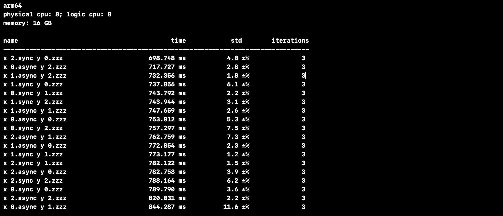
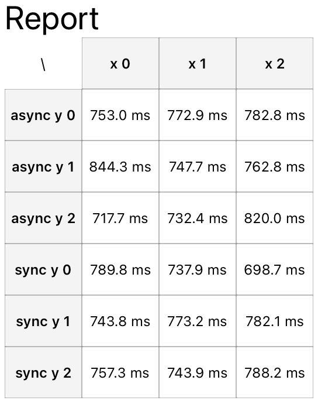

# BenchmarkKit

BenchmarkKit is a performance benchmarking toolkit for iOS and macOS platforms. It provides a simple yet powerful API to help developers measure and optimize application performance.





## Requirements

- iOS 16.0+
- macOS 14.0+
- Swift 5.9+

## Installation

### Swift Package Manager

In Xcode, select File > Add Packages... and enter the repository URL:

```
https://github.com/vince-hz/BenchmarkKit.git
```

Or add the dependency to your `Package.swift` file:

```swift
dependencies: [
    .package(url: "https://github.com/vince-hz/BenchmarkKit.git", from: "1.0.0")
]
```

## Usage

```swift
import BenchmarkKit

  // Setup works. (Also there are async work you can check in the source code.)
BenchmarkKit.measureWork(
    MeasureInput(
        taskName: "xxx",
        impLabel: "yyy",
        resourceCaseLabel: "zzz",
        performQueue: .main,
        performTimes: 3,
        prepare: { done in
            done("some prepared input")
        },
        syncWork: { prepared in
            print("this is prepared data.", prepared)
            // do some sync work.
        },
        finishedHandler: { _ in }
    )
)
// Get results.
let results = await BenchmarkKit.main()
// Print report.
let report = BenchmarkKit.report(results: results)
print(report)
// Preview the report with SwiftUI
let formView = BenchmarkKit.formView(results: results, title: "some title")
```

## License

BenchmarkKit is available under the MIT license. See the [LICENSE](LICENSE) file for more info.